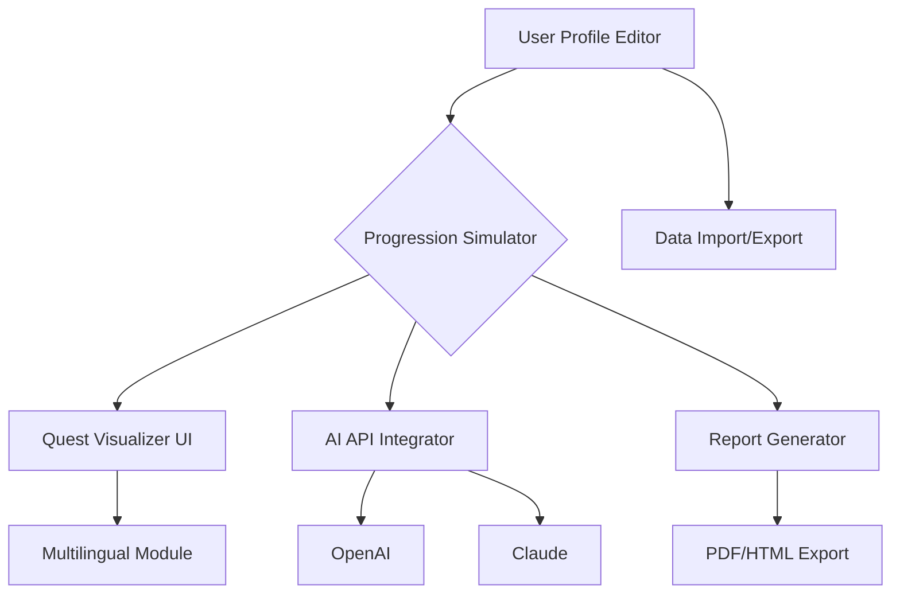

# CrimsonDesert-Quest-Optimizer 🚩
**A Standalone Visual Quest & Progression Planner for Crimson Desert | Immersive ImGui UI | Safe Demo Mode | Source Project**

---

## Table of Contents

- [✨ Overview](#-overview)
- [🧭 Features](#-features)
- [🌐 OS Compatibility](#-os-compatibility)
- [🤖 OpenAI & Claude API Integration](#-openai--claude-api-integration)
- [👁️‍🗨️ Responsive Visual UI](#️️‍️️️️️️-responsive-visual-ui)
- [🌍 Multilingual Capabilities](#-multilingual-capabilities)
- [🕛 24/7 Community Support](#-247-community-support)
- [📊 Mermaid Diagram: System Overview](#-mermaid-diagram-system-overview)
- [🗂️ Example Profile Configuration](#-example-profile-configuration)
- [🖥️ Example Console Invocation](#-example-console-invocation)
- [⚡ SEO-Optimized Keywords](#-seo-optimized-keywords)
- [⚖️ License](#-license)
- [❗ Disclaimer](#-disclaimer)
- [⬇️ Download](#️-download)

---

## ✨ Overview

**CrimsonDesert-Quest-Optimizer** is the ultimate standalone application for reimagining and planning your _Crimson Desert_ character’s journey. Born from the desire to empower RPG enthusiasts and creative storytellers, Quest Optimizer functions as smart quest mapping software, offline demo, and a visual progression tracker, all wrapped in a modern ImGui-based overlay UI. 

This solution is more than just a quest log editor—it’s an intelligent, analytical, and narrative-driven progression simulation. Craft novel adventurer profiles, preview outcomes, strategize collectibles and achievements, and visualize progression arcs—without ever touching live game data. Perfect for fans, lore explorers, theorycrafters, and spreadsheet wizards alike!

---

## 🧭 Features

- **Visual Quest Tree Editor:** Drag-and-drop quest milestones, dependencies, and secret arcs in a rich, responsive overlay.
- **Progression Simulation:** Emulate multiple advancement paths, resource expenditures, and narrative choices for comparison.
- **Instant Reward Configuration:** Adjust and preview the resource, XP, and item outcomes for each quest branch.
- **Data-Driven Insights:** Import and analyze exported profiles; review progression speed, gaps, and achievement percentages.
- **Offline Demo Mode:** Experiment safely—no risk to your actual game data or account.  
- **OpenAI/Claude Integration:** Generate suggested quest orders, identify bottlenecks, or brainstorm side narratives using AI-powered contextual analysis.
- **Extensible Plugin Support:** Add your own automation scripts; contribute new triggers and achievement recipes.
- **Multilingual UI & Localization:** Experience robust language support for a global hero community.
- **Live Responsive Interface:** Retina-ready, adaptive layouts, and smooth interactivity with full keyboard/mouse support.
- **Profile Export/Import:** Save, share, and revisit extraordinary character journies or share optimized profiles with others.
- **Detailed Report Generation:** Export beautiful journey summaries as PDF or HTML for wikis, blogs, or personal archiving.
- **Advanced Search & Filtering:** Find that one obscure side quest—it’s in here!
- **Optimized for Performance:** Lightweight and designed for low system impact, whether overlayed or in standalone mode.

---

## 🌐 OS Compatibility

| Platform      | Supported | Notes                                    |
|---------------|:---------:|:-----------------------------------------|
| Windows 10/11 |     ✅    | Full feature support, overlay included   |
| macOS         |     ✅    | Standalone UI, overlay via helper app    |
| Linux         |     ✅    | Full support, tested on Ubuntu & Fedora  |
| Steam Deck    |     🔄    | Planned for 2026, early alpha available  |

---

## 🤖 OpenAI & Claude API Integration

CrimsonDesert-Quest-Optimizer intelligently leverages cutting-edge AI tools. Generate optimal quest routes, analyze narrative tension, and brainstorm epic custom questlines:

- **Input:** Select multiple quests or quest chains.
- **API Action:** Generator consults OpenAI/Claude for best optimization, bottleneck identification, or creative quest suggestions.
- **Output:** Receive ranked recommendations, narrative arc summaries, and potential alternate resolutions—instantly.

**API Keys:** Plug in your API credentials inside the app settings or use the environment variable mode.

---

## 👁️‍🗨️ Responsive Visual UI

Experience silky-smooth, retina-quality overlays. Optimized ImGui rendering ensures zero lag, while intuitive drag/zoom lets you navigate even the wildest progression trees with the precision of a bard composing a ballad.

---

## 🌍 Multilingual Capabilities

Our global traveler’s toolkit supports:

- English 🇬🇧
- Korean 🇰🇷
- Japanese 🇯🇵
- Chinese (Simplified) 🇨🇳
- German 🇩🇪
- French 🇫🇷
- Spanish 🇪🇸

And it’s extensible: contribute localization packs or help us crowdsource more languages!

---

## 🕛 24/7 Community Support

Open-source doesn’t mean you’re alone. Our Discord server and issue tracker serve as the trusty compass and well-worn map for every adventurer. Expect rapid responses, peer collaborations, and regular updates—year-round.

---

## 📊 Mermaid Diagram: System Overview

---

## 🗂️ Example Profile Configuration

Here’s a sample user profile file (YAML format) to get you started:

user_profile:
  name: "Aurelia the Resolute"
  current_level: 22
  quest_chain:
    - name: "Echoes of the Crimson Dawn"
      status: "In Progress"
      started_at: "2026-06-12"
      milestones_completed: 3
      total_milestones: 7
    - name: "Whispering Hollows"
      status: "Locked"
      prerequisites:
        - "Echoes of the Crimson Dawn"
  inventory:
    gold: 1500
    scrolls_of_learning: 4
    rare_gems: 2
  planned_skills:
    - "Song of Blades"
    - "Resilient Ward"

---

## 🖥️ Example Console Invocation

Run a quick CLI simulation for Aurelia’s next quest arc:

$ crimsondesert-quest-optimizer simulate-profile --input config/user_aurelia.yaml --ai-plugin=Claude --report=HTML --output reports/aurelia_progression.html

---

## ⚡ SEO-Optimized Keywords

For discoverability and future-proofing, the following phrases are woven throughout:

- Crimson Desert quest planning tool
- Player progression simulator
- Visual quest chain editor for Crimson Desert
- RPG narrative optimizer
- ImGui overlay for RPGs
- AI-powered quest route suggestions
- Modding toolkit for RPG progression
- RPG journey report generator

---

## ⚖️ License

Licensed under the **MIT License**. See full license text here: [MIT LICENSE](https://opensource.org/licenses/MIT)  
Copyright © 2026

---

## ❗ Disclaimer

This project is a creative, standalone interpretation and simulation toolkit. It does not interact with or modify live Crimson Desert servers, accounts, or game binaries. Crimson Desert and all associated content are the property of their respective owners. Quest-Optimizer is designed for theorycrafting, planning, and narrative prototyping—**use at your own ambition, and never for unauthorized or unfair advantage.**

---

## ⬇️ Download

  

---

Go forth—and become the architect of your adventure!